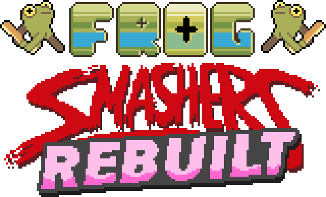

# Frog Smashers Rebuilt

A MonoGame port of Frog Smashers for Windows and Linux. Up to eight players with local and online (rollback) multiplayer. 

## Docs

Controls: [controls.md](docs/controls.md) \
Source layout: [layout.md](docs/layout.md) \
Assets/Content: [Content readme](src/Content/README.md)
## Build

- Install the .NET SDK specified by `global.json`:

```sh
dotnet build FrogSmashersRebuilt.slnx -c Release -m:1
dotnet run --project src/Client -c Release --no-build
```

```sh
./scripts/test.sh
./scripts/publish.sh all
./scripts/publish.sh win-x64
```

### Credits
[CREDITS.txt](CREDITS.txt) \
Original programming/design: **Ruan Rothmann**. \
Art/animation: **Mike Scott**. \
Additional art: **Ben Rausch and Stuart Coutts**. \
Sound: **Jason Sutherland**. \
[Fork](https://github.com/PNone/frogsmashers) features and fixes: **PNone**.

### License
[LICENSE.md](LICENSE.md)
